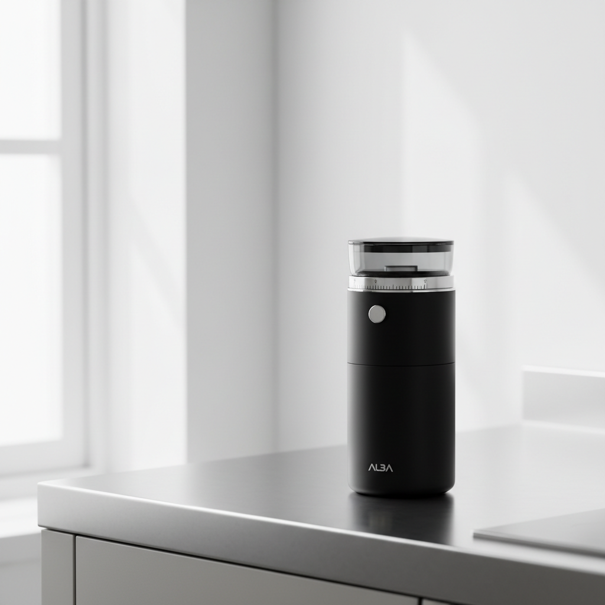
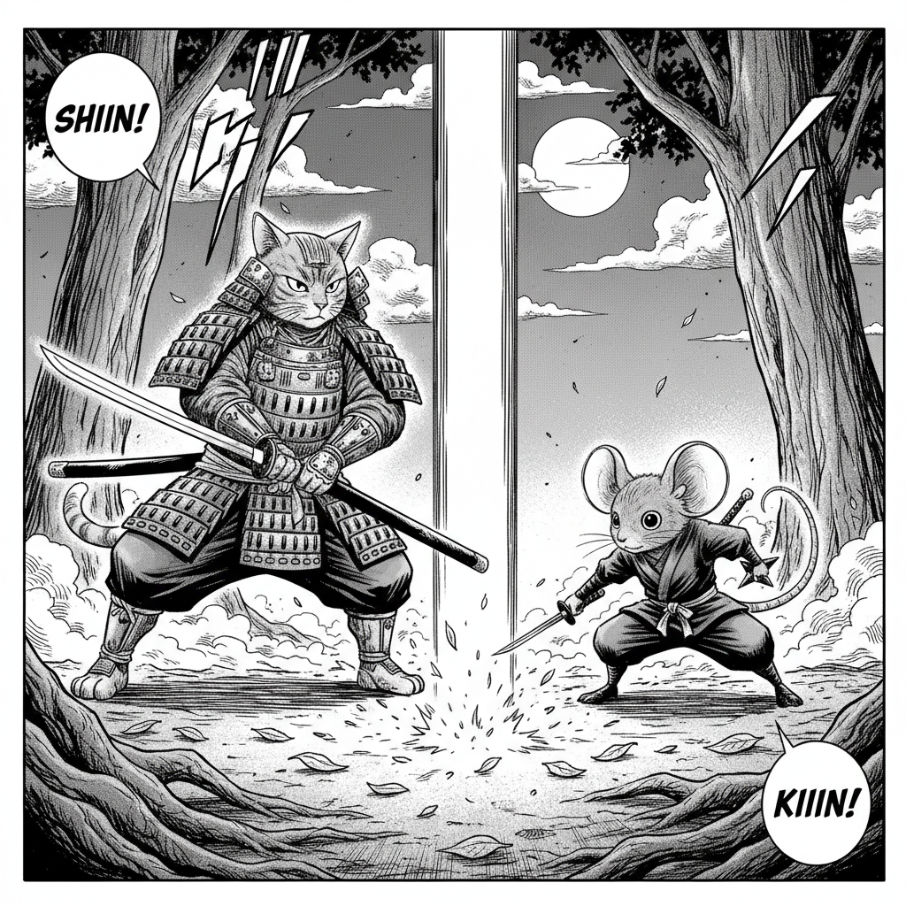

# Runway.Cli.Examples

**A visual showcase of [`Runway.Cli`](https://github.com/tryAGI/Runway) + the [`runway-cli`](https://github.com/tryAGI/Runway#use-as-an-agent-skill) agent skill + [Claude Code](https://claude.com/claude-code) as the orchestrator.**

Each example is a tiny bash wrapper that hands a **minimal user-style prompt** to `claude -p` running headless. Claude — guided by the installed `runway-cli` skill — picks the right Runway CLI commands, generates intermediate assets when needed, and writes a final `result.json` describing what it made.

**No pre-existing assets are required.** Every example runs from zero.

---

## Showcase

|                              | One-sentence prompt                                              | What Claude produced                                                                              | Time    |
|------------------------------|------------------------------------------------------------------|---------------------------------------------------------------------------------------------------|---------|
| **[`image`](./examples/image/)** | *"a minimalist coffee grinder on brushed steel, soft morning light"* | One Runway-generated PNG + `result.json` (title, description, prompt, model, image path)          | ~49 s   |
| **[`manga`](./examples/manga/)** | *"a 3-page manga about a samurai cat befriending a rival ninja mouse"* | Character ref sheets + multi-page storyboard + rendered panels + `result.json` tying it together  | 3–17 min |

### Preview

|  `image`                                                                    |  `manga` (page 1)                                                                       |
|-----------------------------------------------------------------------------|-----------------------------------------------------------------------------------------|
|  |  |

See each example's README for the **full prompt, inputs, outputs, and run instructions** in a consistent layout (prompt → inputs → what Claude did → output → run it → cost).

---

## Setup

Prereqs: [Claude Code](https://claude.com/claude-code), [.NET 10+](https://dot.net), [Node.js](https://nodejs.org/) (for `npx`), `jq`, a Runway API key.

```bash
git clone https://github.com/tryAGI/Runway.Cli.Examples.git
cd Runway.Cli.Examples
cp .env.example .env
# Edit .env and set RUNWAY_API_KEY
./scripts/setup.sh
```

## How the skill is installed

`scripts/setup.sh` runs the install command documented in the upstream Runway repo ([Runway/README.md#use-as-an-agent-skill](https://github.com/tryAGI/Runway#use-as-an-agent-skill)):

```bash
npx skills add tryAGI/Runway -a claude-code -y
```

This drops the skill at `.claude/skills/runway-cli/SKILL.md` (provided by the [skills.sh](https://skills.sh) ecosystem). Headless `claude -p` invocations in this repo pick it up automatically. The skill file itself is **not committed** — it is re-installed by `setup.sh` on a fresh clone. The auto-generated [`skills-lock.json`](./skills-lock.json) records the exact source + hash for reproducibility.

## Run an example

```bash
./examples/image/run.sh     # ~49 s, ~$0.14
./examples/manga/run.sh     # ~3–6 min with the workflow nudge
```

Output lands in `output/<example>/<ISO-timestamp>/`:

```
output/<example>/<timestamp>/
├── result.json     # the final JSON Claude produced
├── transcript.json # the raw `claude -p --output-format json` envelope
├── meta.json       # claude version, runway version, cost, session id
└── assets/         # generated PNGs (and MP4s for video examples)
```

Each example also commits a `sample-output/` directory containing real artifacts from a real run, so the README previews are honest evidence rather than mockups.

## Examples index

| Workflow                       | Status     | Path                              |
|--------------------------------|------------|-----------------------------------|
| image (json-to-image)          | shipped    | [`examples/image/`](./examples/image/) |
| manga (json-to-manga)          | shipped    | [`examples/manga/`](./examples/manga/) |
| video                          | planned    | `examples/video/`                 |
| image-to-video                 | planned    | `examples/image-to-video/`        |
| short-video                    | planned    | `examples/short-video/`           |
| product-photoshoot             | planned    | `examples/product-photoshoot/`    |
| marketplace-cards              | planned    | `examples/marketplace-cards/`     |
| ad-video                       | planned    | `examples/ad-video/`              |
| avatar                         | planned    | `examples/avatar/`                |
| soul-id                        | planned    | `examples/soul-id/`               |
| photo-restyle                  | planned    | `examples/photo-restyle/`         |
| scene-composition              | planned    | `examples/scene-composition/`     |
| story-sequence                 | planned    | `examples/story-sequence/`        |
| character-item                 | planned    | `examples/character-item/`        |
| video-sandbox                  | planned    | `examples/video-sandbox/`         |
| (more named workflows)         | planned    | —                                 |

The goal is **one example per Runway CLI workflow** — each with the same showcase layout so you can scan the whole repo and see Runway's surface area at a glance.

## Reproducibility

Runs are non-deterministic. Each run captures a `meta.json` with:

- `claude` CLI version
- `runway` (Runway.Cli) version
- total cost in USD
- Anthropic session id (for replay/debugging)

## Contributing a new example

Every example follows the same six-section README so the repo reads as a uniform showcase:

1. **The prompt** — one or two sentences in user voice, telling Claude *what*, not *how*
2. **Inputs** — env vars, no pre-existing assets
3. **What Claude did** — the workflow Claude orchestrated
4. **Output** — embedded PNGs/MP4s + a `result.json` snippet (real artifacts in `sample-output/`)
5. **Run it** — the exact command
6. **Cost & runtime** — observed numbers from a real run

To add one:

1. `cp -r examples/image examples/<workflow-name>/`
2. Rewrite `prompt.md` for the new workflow
3. Run `./examples/<workflow-name>/run.sh` once and commit a curated subset of the output into `sample-output/`
4. Update the README following the six-section structure
5. Add a row to the **Examples index** table above

The skill teaches Claude how to drive Runway. Your example just needs to ask, in plain language, and capture the result.

## Related

- [tryAGI/Runway](https://github.com/tryAGI/Runway) — the SDK, CLI, and skill
- [skills.sh](https://skills.sh) — agent-skill ecosystem this repo consumes
- [Claude Code](https://claude.com/claude-code) — the agent runtime
