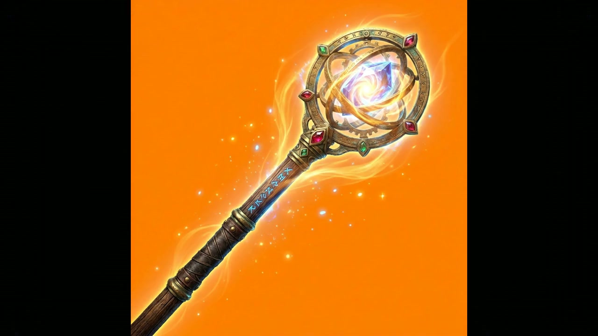
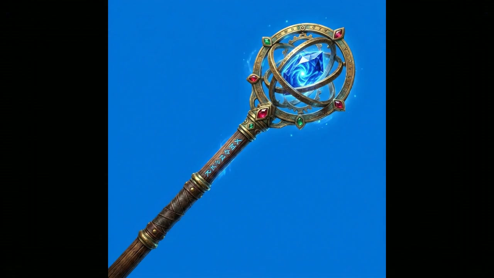
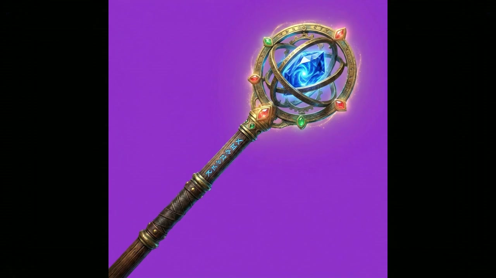
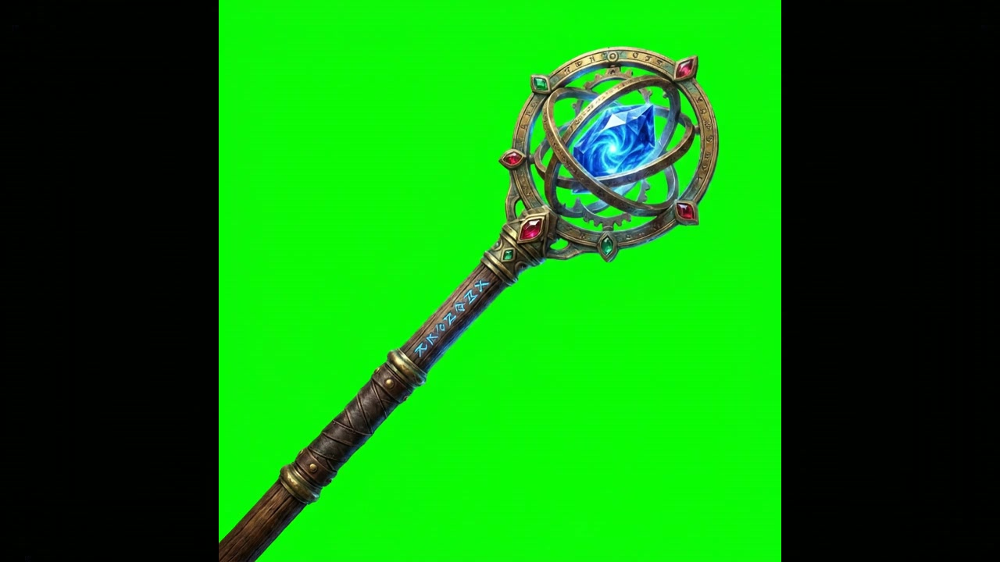

# `game-item` — text → 4 rarity icons + animated icon MP4

> Showcases the **`game-item-generator`** workflow targeting the game-dev vertical: one text description produces four rarity-tier variants (common → legendary) of the same item plus an animated icon clip. From zero — no source image needed.

## 1. The prompt

What we hand to Claude — verbatim, the way a user would type it ([`prompt.md`](./prompt.md)):

> Use the runway `game-item-generator` workflow to design an RPG loot item from a one-line description: a jeweled rune-staff with a glowing sapphire core, oak handle, in the hex color #2C5F8D. Give it a subtle levitating loop with gentle sapphire glow for the animated icon. Save every output (the 4 rarity-tier variants + the animated icon MP4) and emit a result.json describing the item, motion, model, and file paths.

## 2. Inputs

- `RUNWAY_API_KEY` (loaded from `.env`)
- The [`runway-cli`](https://github.com/tryAGI/Runway#use-as-an-agent-skill) skill installed at `.claude/skills/runway-cli/`
- **No pre-existing assets** — text only.

## 3. What Claude did

Guided only by the skill, Claude:

1. **Invoked `runway game-item-generator`** with `--item` and `--motion`.
2. **Captured every output** the workflow returned (rarity variants + animated MP4).
3. **Wrote `result.json`** tying them together.

One CLI call (`game-item-generator`) that fans out into N image renders + 1 video render.

## 4. Output

### Four rarity-tier animated icons

The workflow returns one animated icon per rarity tier (common / uncommon / rare / legendary). All four share the underlying item design (the oak-and-brass rune-staff with sapphire core that the prompt described); they differ in background, lighting, and animated effects.

**Legendary tier (animated, green-screen for game compositing):**

<video src="https://github.com/tryAGI/Runway.Cli.Examples/raw/main/examples/game-item/sample-output/assets/animated-icon-legendary.mp4" controls muted playsinline width="400"></video>

All four tier presentations (extracted as stills from the workflow's MP4 outputs). The background colour signals rarity in the standard RPG order: orange (common) → blue (uncommon) → purple (rare) → green-screen (legendary).

|  Common — sparkle / fire effects                                | Uncommon — clear blue background                                |
|-----------------------------------------------------------------|-----------------------------------------------------------------|
|     |  |
| **Rare — purple glow halo**                                     | **Legendary — green-screen for compositing**                    |
|         |  |

Full-quality MP4s (one per tier):
- [`animated-icon-common.mp4`](./sample-output/assets/animated-icon-common.mp4)
- [`animated-icon-uncommon.mp4`](./sample-output/assets/animated-icon-uncommon.mp4)
- [`animated-icon-rare.mp4`](./sample-output/assets/animated-icon-rare.mp4)
- [`animated-icon-legendary.mp4`](./sample-output/assets/animated-icon-legendary.mp4)

### The `result.json` Claude wrote

See [`sample-output/result.json`](./sample-output/result.json).

## 5. Run it

```bash
./examples/game-item/run.sh
```

## 6. Cost & runtime

| Metric           | Value (observed)                                                |
|------------------|-----------------------------------------------------------------|
| Wall time        | **~6 min**                                                      |
| Claude cost      | **$0.32** (Sonnet 4.6)                                          |
| Runway credits   | **675** (the workflow renders four icon clips and four animated icons; `veo3.1` is the costly part) |
| Runway calls     | 1 × `game-item-generator` (fans out into 8 video renders total) |
| Budget ceiling   | `CLAUDE_MAX_BUDGET_USD=4`                                       |
