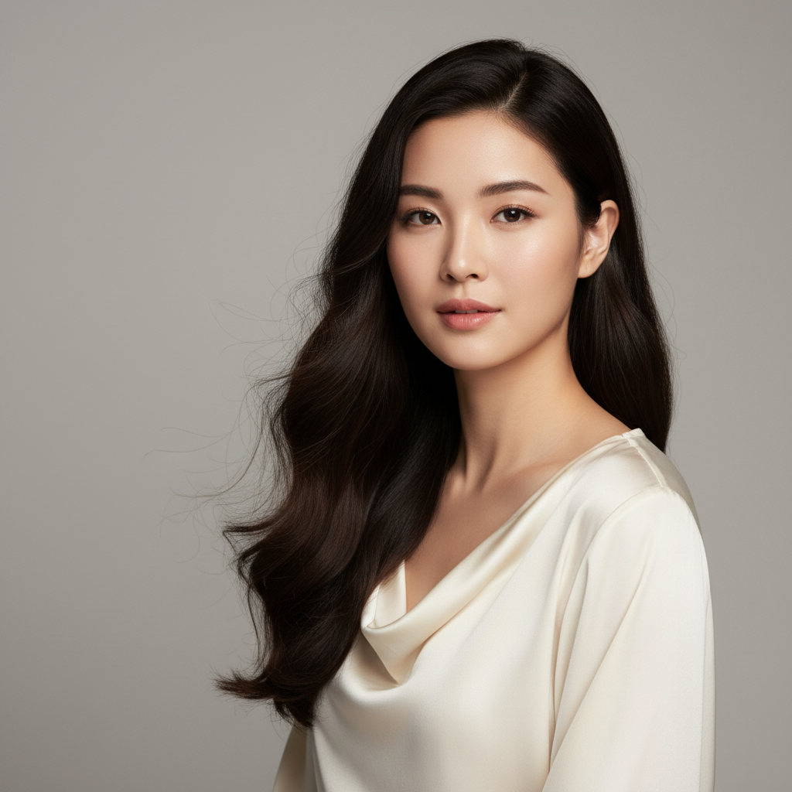
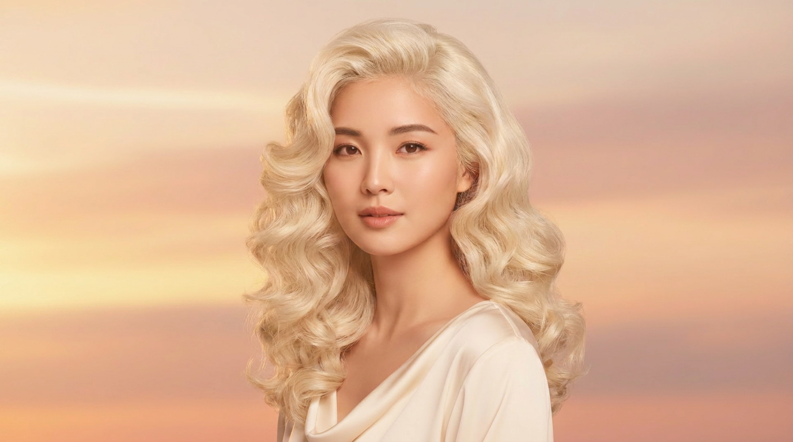
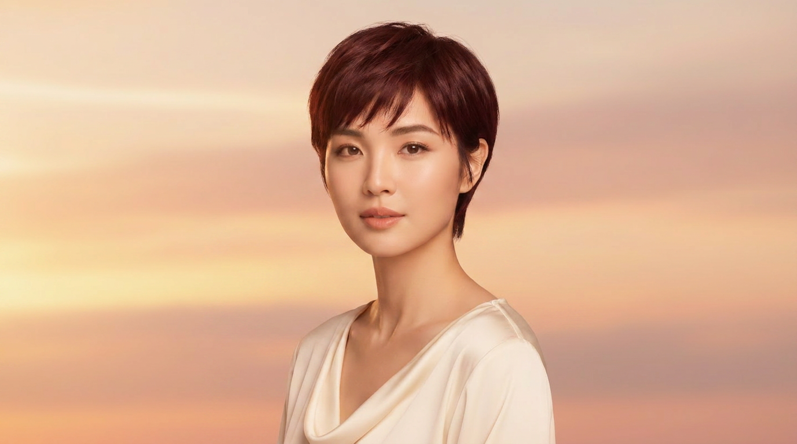

# `haircut` — generate a portrait, then restyle the hair

> Showcases the **`ai-hair-salon`** named workflow: change one attribute (hair) of a photo while keeping the subject recognizable. Run from zero — the input portrait is generated on the fly, no source image needed.

## 1. The prompt

What we hand to Claude — verbatim, the way a user would type it ([`prompt.md`](./prompt.md)):

> Give someone a virtual haircut: first generate a portrait of a person with long dark hair, then use the runway `ai-hair-salon` workflow to restyle their hair as a shoulder-length wavy bob with subtle blonde highlights against a soft sunset gradient backdrop. Save both the original portrait and the restyled output, then emit a single result.json describing the before/after image paths, the portrait prompt, the hairstyle change, and the workflow used.

## 2. Inputs

- `RUNWAY_API_KEY` (loaded from `.env`)
- The [`runway-cli`](https://github.com/tryAGI/Runway#use-as-an-agent-skill) skill installed at `.claude/skills/runway-cli/` (done by `./scripts/setup.sh`)
- **No pre-existing assets** — Claude generates the input portrait first.

## 3. What Claude did

Guided only by the skill, Claude:

1. **Generated a portrait** via `runway image` (text-to-image) — a young woman with long flowing dark hair, neutral studio background.
2. **Ran the `ai-hair-salon` workflow** on that portrait, passing `--hairstyle "shoulder-length wavy bob with subtle blonde highlights..."` and `--background "soft sunset gradient backdrop..."`.
3. **Received four variations** of the same subject — the workflow returns multiple interpretations of the hair brief.
4. **Wrote `result.json`** linking the original portrait to all four restyled outputs.

Two Runway calls total: one `runway image` + one `ai-hair-salon` workflow.

## 4. Output

### Before / After

|  Before (generated portrait)                                | After (closest to prompt — bob + blonde highlights)                     |
|-------------------------------------------------------------|--------------------------------------------------------------------------|
|     |  |

### Other variations returned by the workflow

|  Platinum waves                                                                          |  Pixie cut                                                              |
|------------------------------------------------------------------------------------------|--------------------------------------------------------------------------|
|                     |                   |

Note the consistency: same face, same wardrobe, same lighting in the after shots. The workflow restyles only the hair (and the requested background).

### The `result.json` Claude wrote

See [`sample-output/result.json`](./sample-output/result.json) for the full file.

```json
{
  "before": {
    "path": "assets/01-before.png",
    "prompt": "studio portrait of a young woman with long flowing dark hair ...",
    "model": "gemini-2.5-flash",
    "ratio": "1024:1024"
  },
  "after": {
    "paths": ["assets/02-after-bob-blonde.png", "assets/03-after-platinum-waves.png", "assets/04-after-pixie.png"],
    "hairstyle": "shoulder-length wavy bob with subtle blonde highlights ...",
    "background": "soft sunset gradient backdrop ..."
  },
  "workflow": {
    "name": "ai-hair-salon",
    "id": "c4674e34-b2cc-47fc-8684-a3c5aed54848",
    "invocation_id": "210f3ac7-3318-440e-b77f-1ae907dfde70",
    "status": "SUCCEEDED",
    "variations": 4
  }
}
```

## 5. Run it

```bash
./examples/haircut/run.sh
```

Per-run output lands under `output/haircut/<ISO-timestamp>/` (same shape as the other examples).

## 6. Cost & runtime

| Metric           | Value (observed)                          |
|------------------|-------------------------------------------|
| Wall time        | **~3 min**                                |
| Claude cost      | **$0.31** (Sonnet 4.6)                    |
| Runway credits   | **95** (7 for the portrait + 88 for the `ai-hair-salon` workflow returning 4 variations) |
| Runway calls     | 1 × `runway image` + 1 × `ai-hair-salon`  |
| Budget ceiling   | `CLAUDE_MAX_BUDGET_USD=3`                 |

Override per run: `CLAUDE_MAX_BUDGET_USD=5 ./examples/haircut/run.sh`.
