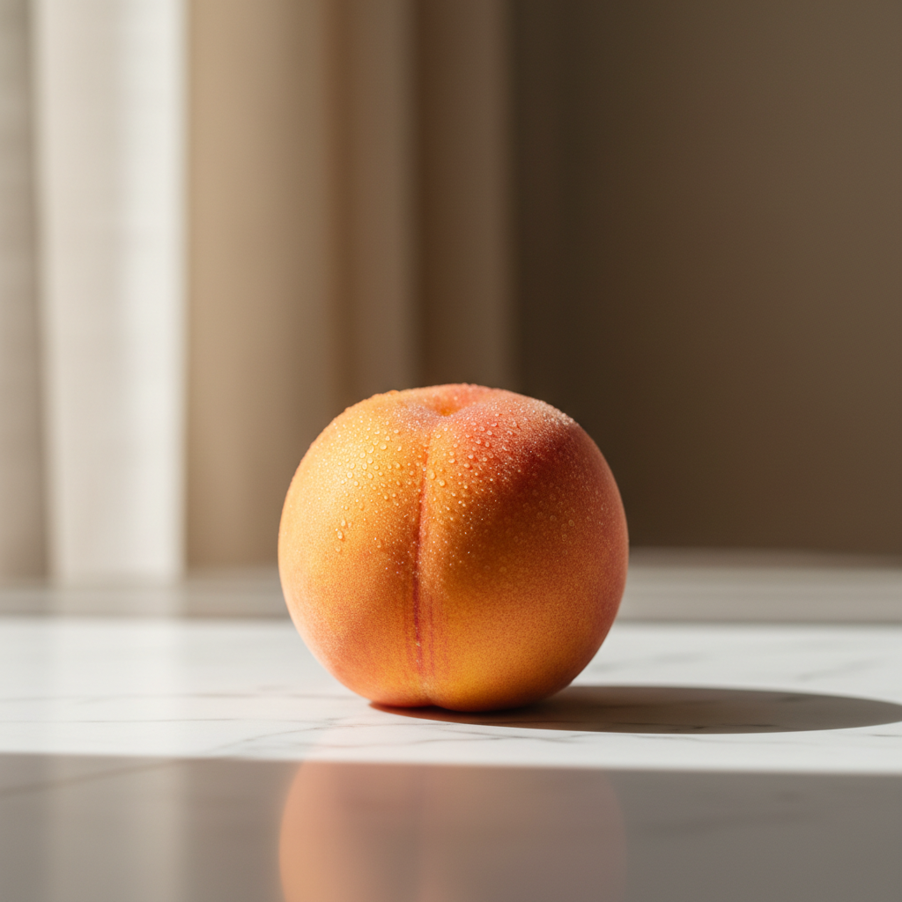

# `image-to-video` — generated still → animated MP4

> The most-asked-for video pattern: take one still image and bring it to life with motion. From zero — the still is generated by `runway image` first, then animated by `runway image-to-video`.

## 1. The prompt

What we hand to Claude — verbatim, the way a user would type it ([`prompt.md`](./prompt.md)):

> Showcase the `image-to-video` workflow from zero. First generate a static hero image — a single ripe peach on a marble countertop in soft window light, food-magazine aesthetic. Then run runway `image-to-video` on that image with a short motion prompt like "slow push-in, condensation droplets glistening, gentle ambient steam" to animate it into a short cinematic clip (use `gen4-turbo` if appropriate). Save the original still and the output MP4, then emit a single result.json describing the still prompt, the motion prompt, the model, and the file paths.

## 2. Inputs

- `RUNWAY_API_KEY` (loaded from `.env`)
- The [`runway-cli`](https://github.com/tryAGI/Runway#use-as-an-agent-skill) skill installed at `.claude/skills/runway-cli/`
- **No pre-existing assets** — Claude generates the still first.

## 3. What Claude did

Guided only by the skill, Claude:

1. **Generated a hero still** via `runway image` (text-to-image).
2. **Animated the still** via `runway image-to-video --image <still> --model gen4-turbo` with a motion prompt.
3. **Wrote `result.json`** linking still → MP4.

Two Runway calls: one image, one image-to-video.

## 4. Output

### Still and final animation

|  Hero still (generated)                                |  Final MP4 (animated)                                      |
|--------------------------------------------------------|------------------------------------------------------------|
|         | [▶ animation.mp4](./sample-output/assets/animation.mp4)    |

### The `result.json` Claude wrote

See [`sample-output/result.json`](./sample-output/result.json).

## 5. Run it

```bash
./examples/image-to-video/run.sh
```

## 6. Cost & runtime

| Metric           | Value (observed)                                |
|------------------|-------------------------------------------------|
| Wall time        | **~3 min**                                      |
| Claude cost      | **$0.20** (Sonnet 4.6)                          |
| Runway credits   | **55** (~7 still + ~48 for `gen4-turbo` animation) |
| Runway calls     | 1 × `runway image` + 1 × `runway image-to-video`|
| Budget ceiling   | `CLAUDE_MAX_BUDGET_USD=4`                       |
