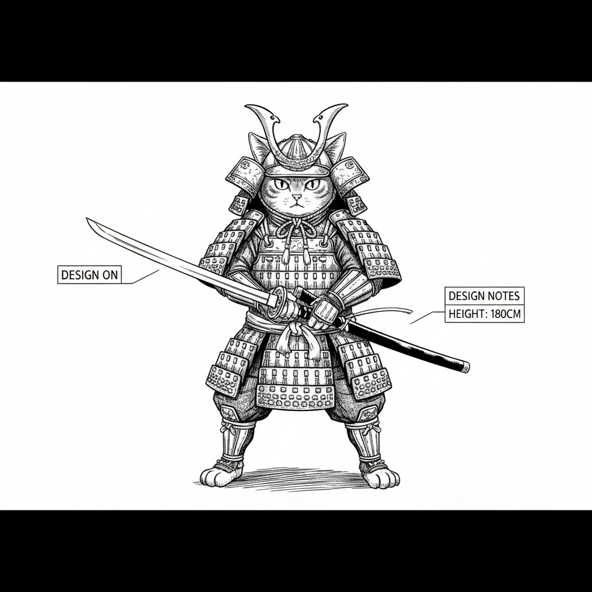
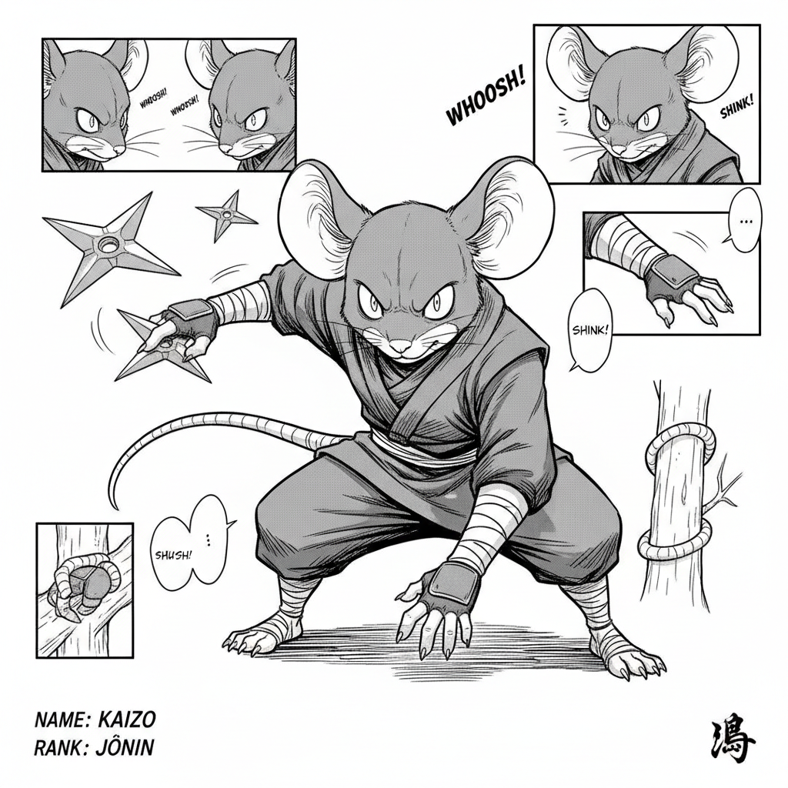
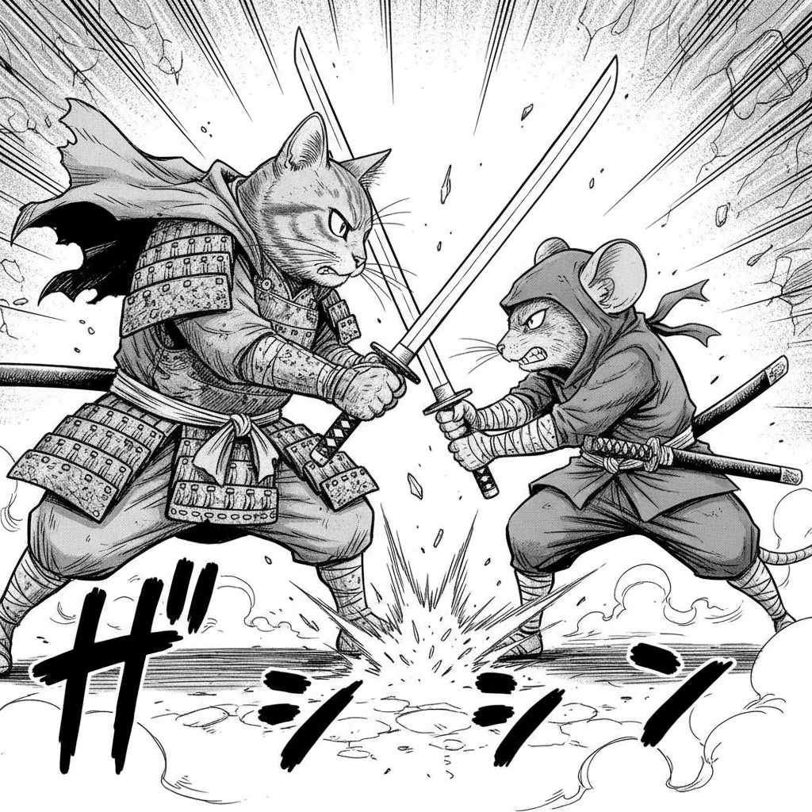
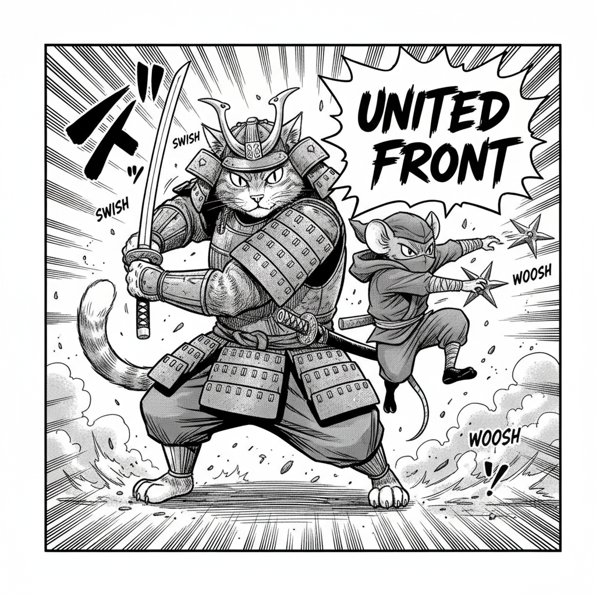
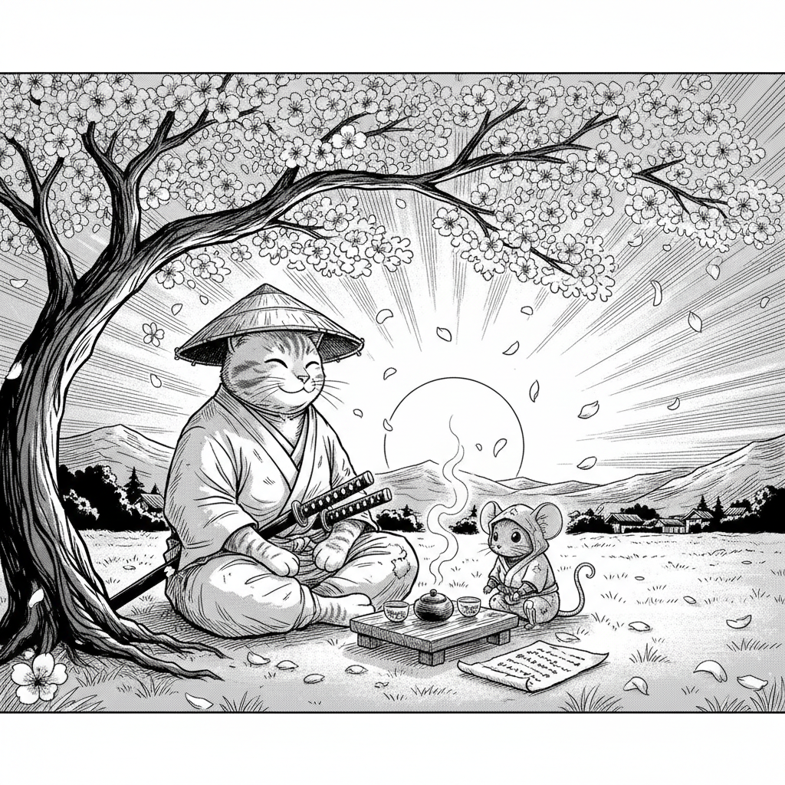

# `manga` — json-to-manga

> One sentence in → a multi-page manga out: character refs, panel images, captions, dialogue, all assembled as JSON. The flagship showcase of how far Claude Code + the `runway-cli` skill can push Runway from a casual user prompt.

## 1. The prompt

What we hand to Claude — verbatim, the way a user would type it ([`prompt.md`](./prompt.md)):

> Make a short 3-page manga about a samurai cat befriending a rival ninja mouse. Use the `json-to-manga` workflow from the runway-cli skill so the panels render in a single workflow call rather than one image at a time. Generate one character reference image to feed the workflow, then write the storyboard JSON, run the workflow, and emit a single result.json describing the title, character, pages, and panels (image path, dialogue, caption).

## 2. Inputs

- `RUNWAY_API_KEY` (loaded from `.env`)
- The [`runway-cli`](https://github.com/tryAGI/Runway#use-as-an-agent-skill) skill installed at `.claude/skills/runway-cli/` (done by `./scripts/setup.sh`)
- **No pre-existing assets** — characters, storyboard, and panels are all synthesized from scratch.

## 3. What Claude did

Guided only by the skill, Claude (in the showcased run):

1. **Invented characters.** Katsuro the samurai cat ("noble orange tabby in black and gold do-maru lamellar armor") and Chu the ninja mouse ("small but lightning-fast grey mouse in dark shinobi shozoku"). Names and descriptions were not in the prompt — Claude filled them in.
2. **Generated character reference sheets** via `runway image` for each.
3. **Wrote a structured storyboard** as JSON (title, pages, panels, dialogue, caption).
4. **Rendered all panels** by chaining `runway image` calls referencing the character refs (since the showcase run pre-dates the `--workflow` nudge — the current `prompt.md` now points Claude at the built-in `runway json-to-manga` workflow for a faster path).
5. **Assembled the final** `result.json` tying characters → pages → panels → image paths.

## 4. Output

### Character reference sheets

|  Katsuro (Samurai Cat)                                          |  Chu (Ninja Mouse)                                  |
|-----------------------------------------------------------------|-----------------------------------------------------|
|  |  |

### Selected panels

> Page 1 — *The Encounter*. Both characters face off in moonlit bamboo woods.
>
> 

> Page 2 — *The Clash*. Neither yields.
>
> 

> Page 3 — *The Common Foe*. A truce in the face of a shared enemy.
>
> 

> Page 4 — *The Bond*. Crossed blades, shared tea.
>
> 

### The `result.json` Claude wrote

Excerpt — see [`sample-output/result.json`](./sample-output/result.json) for the full file (4 pages × 3 panels, 2 characters with 5 reference variants each):

```jsonc
{
  "title": "Claws & Shadows: The Pact of Featherstone",
  "characters": [
    {
      "id": "katsuro",
      "name": "Katsuro",
      "role": "Samurai Cat",
      "description": "A noble orange tabby cat samurai in black and gold do-maru lamellar armor ...",
      "soul_id": "bdd1ae3a10f4",
      "reference_images": ["assets/01-katsuro-ref.png", ...]
    },
    {
      "id": "chu",
      "name": "Chu",
      "role": "Ninja Mouse",
      "description": "A small but lightning-fast grey mouse ninja in dark shinobi shozoku ...",
      "soul_id": "45be6e8df301",
      "reference_images": ["assets/02-chu-ref.png", ...]
    }
  ],
  "pages": [
    {
      "number": 1,
      "title": "The Encounter",
      "panels": [
        {
          "id": "p1-3",
          "image_path": "assets/03-p1-encounter.png",
          "characters_present": ["katsuro", "chu"],
          "dialogue": [
            { "character": "katsuro", "text": "Show yourself, shadow-walker." },
            { "character": "chu",     "text": "Bold words for a whisker-warrior." }
          ]
        }
      ]
    }
  ]
}
```

> **Note.** `sample-output/result.json` references the original hash-named PNGs from the actual run. The renamed showcase PNGs in `sample-output/assets/` are curated for README display. The full original run produced 22 PNGs (10 character ref variants + 12 panels) — see "Cost & runtime" below.

## 5. Run it

```bash
./examples/manga/run.sh
```

Per-run output lands under `output/manga/<ISO-timestamp>/` (same shape as the image example).

## 6. Cost & runtime

The naive showcase run (before the `--workflow` nudge in `prompt.md`):

| Metric         | Value (observed)                                 |
|----------------|--------------------------------------------------|
| Wall time      | **~17 min** (killed after result.json was written) |
| Runway calls   | 22 `runway image` calls                          |
| Budget ceiling | `CLAUDE_MAX_BUDGET_USD=5`                        |

With the current prompt (which steers Claude to `runway json-to-manga`):

| Metric         | Value (expected)                                 |
|----------------|--------------------------------------------------|
| Wall time      | **3–6 min** (single workflow call vs per-panel)  |
| Runway calls   | 1 character image + 1 workflow invocation        |
| Budget ceiling | `CLAUDE_MAX_BUDGET_USD=5`                        |

Override per run: `CLAUDE_MAX_BUDGET_USD=10 ./examples/manga/run.sh`.

## 7. Notes

- **Workflow-first.** The `runway json-to-manga` workflow renders all panels in a single call rather than per-panel image generation. The current `prompt.md` nudges Claude toward it.
- **Non-deterministic.** Character names, dialogue, and panel composition will differ each run.
- **Provenance.** Every run writes `meta.json` (claude version, runway version, cost, Anthropic session id) into the output directory.
