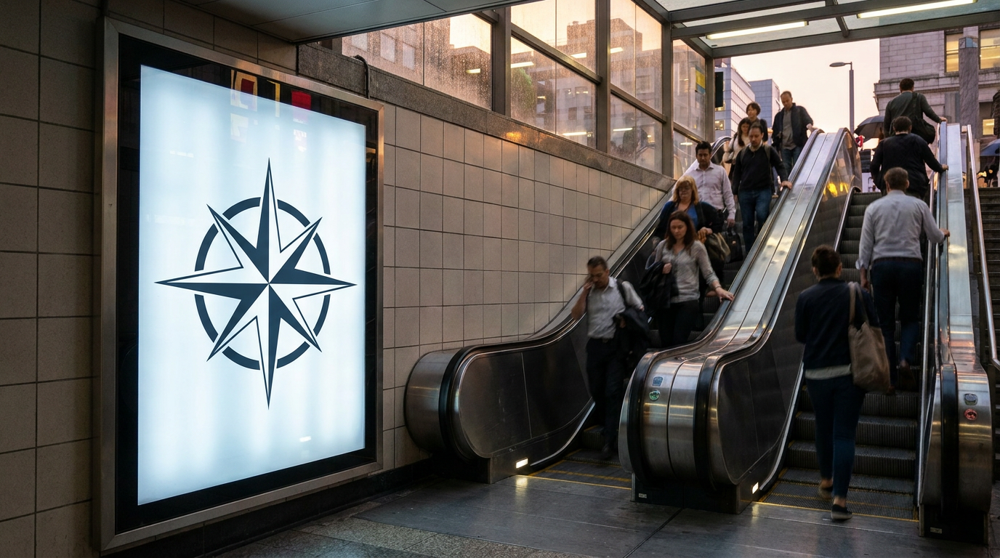
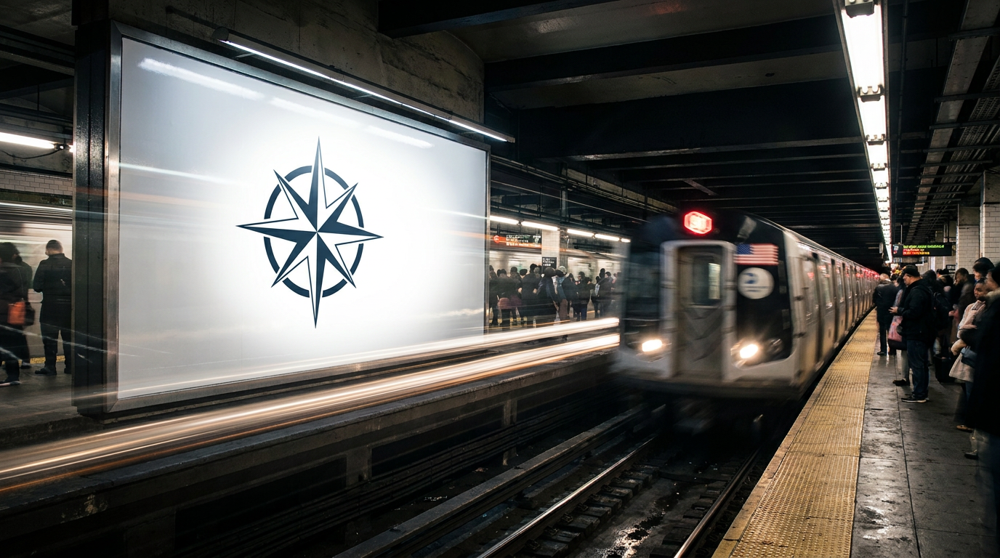
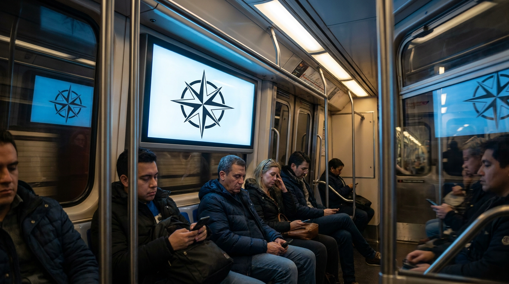
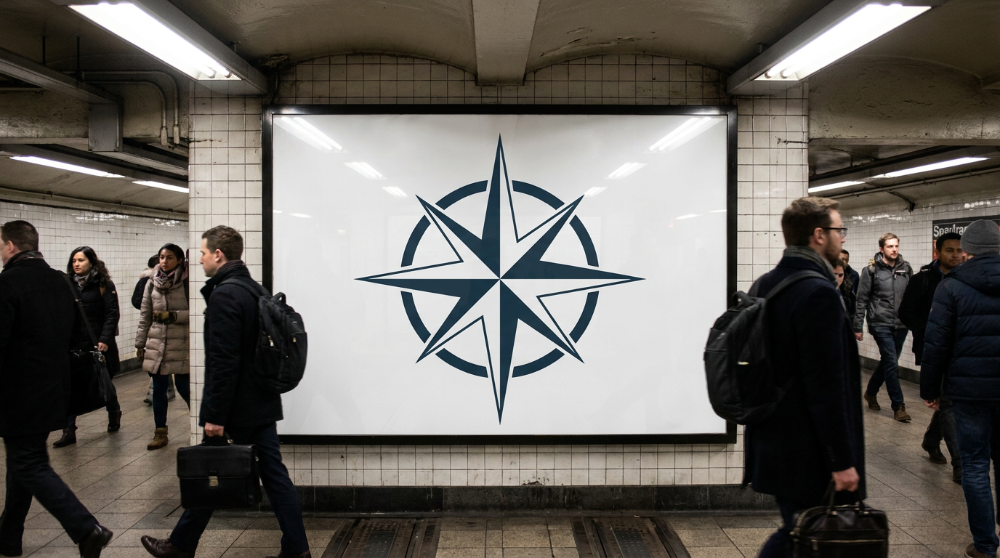

# `mockup` — generated logo → 4 advertising placements

> Showcases the **`mockup-generator`** workflow: take one source image (typically a logo or product) and composite it into multiple real-world advertising contexts. Run from zero — the source logo is generated first.

## 1. The prompt

What we hand to Claude — verbatim, the way a user would type it ([`prompt.md`](./prompt.md)):

> Show off the `mockup-generator` workflow from zero. First generate a clean simple logo image — a minimalist navy compass-rose icon for a fictional travel brand called "Northbound", centered on a plain white background. Then run the runway `mockup-generator` workflow on that logo with a mockup brief like "subway billboard at evening commute, glossy paper, urban setting" so it composites the logo into multiple real-world advertising placements. Save the source logo and the mockup outputs, then emit a single result.json describing the brand, the logo prompt, the mockup brief, and every output path.

## 2. Inputs

- `RUNWAY_API_KEY` (loaded from `.env`)
- The [`runway-cli`](https://github.com/tryAGI/Runway#use-as-an-agent-skill) skill installed at `.claude/skills/runway-cli/`
- **No pre-existing assets** — Claude generates the source logo first.

> **If you already have a logo (or product image)**, the prompt collapses to a single line. With `./logo.png` on disk a real user would just type:
>
> > Use `mockup-generator` on `./logo.png` with a subway-billboard brief at evening commute, glossy paper, urban setting.
>
> The prompt this example commits is longer only because it has to generate the source logo from scratch.

## 3. What Claude did

Guided only by the skill, Claude:

1. **Generated the source logo** via `runway image` (text-to-image).
2. **Ran the `mockup-generator` workflow** with `--image <logo>` + `--mockup "<brief>"`.
3. **Wrote `result.json`** linking the source to the mockup placements.

Two Runway calls total: one `runway image` + one `mockup-generator` workflow returning multiple placement variations.

## 4. Output

### Source logo


### Mockup placements (4 returned)

|  Placement 1                                                          |  Placement 2                                                          |
|-----------------------------------------------------------------------|-----------------------------------------------------------------------|
|  |  |
|  Placement 3                                                          |  Placement 4                                                          |
|  |  |

Same logo, distinct real-world advertising contexts. The workflow's job is to composite the source identity into multiple plausible placements with no manual masking on the user's part.

### The `result.json` Claude wrote

See [`sample-output/result.json`](./sample-output/result.json).

## 5. Run it

```bash
./examples/mockup/run.sh
```

## 6. Cost & runtime

| Metric           | Value (observed)                                                 |
|------------------|------------------------------------------------------------------|
| Wall time        | **~3 min**                                                       |
| Claude cost      | **$0.20** (Sonnet 4.6)                                           |
| Runway credits   | **96** (≈7 for the logo + ≈89 for the workflow returning 4 placements) |
| Runway calls     | 1 × `runway image` + 1 × `mockup-generator`                      |
| Budget ceiling   | `CLAUDE_MAX_BUDGET_USD=3`                                        |
