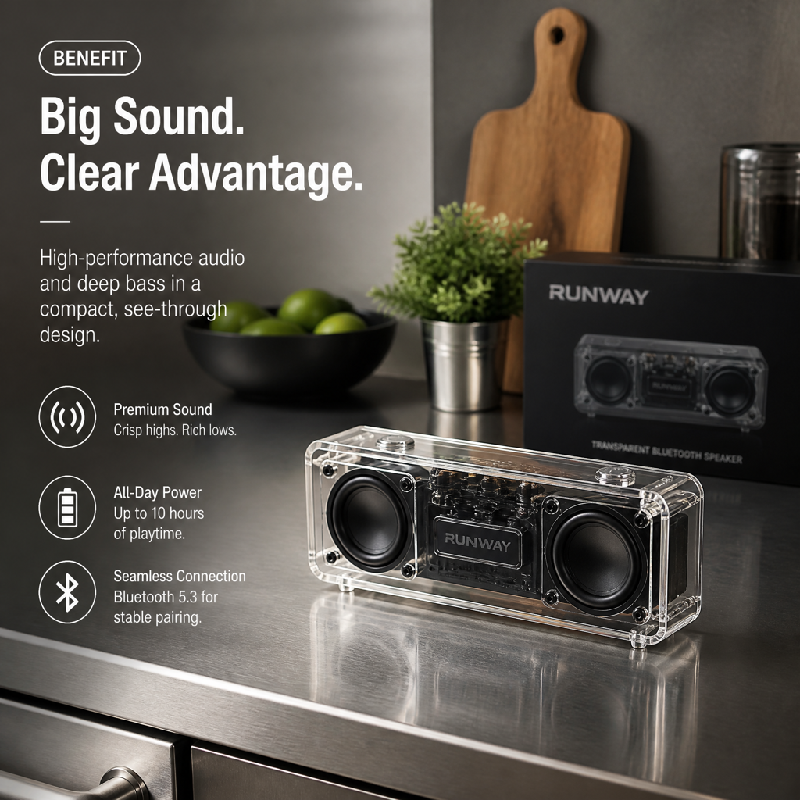
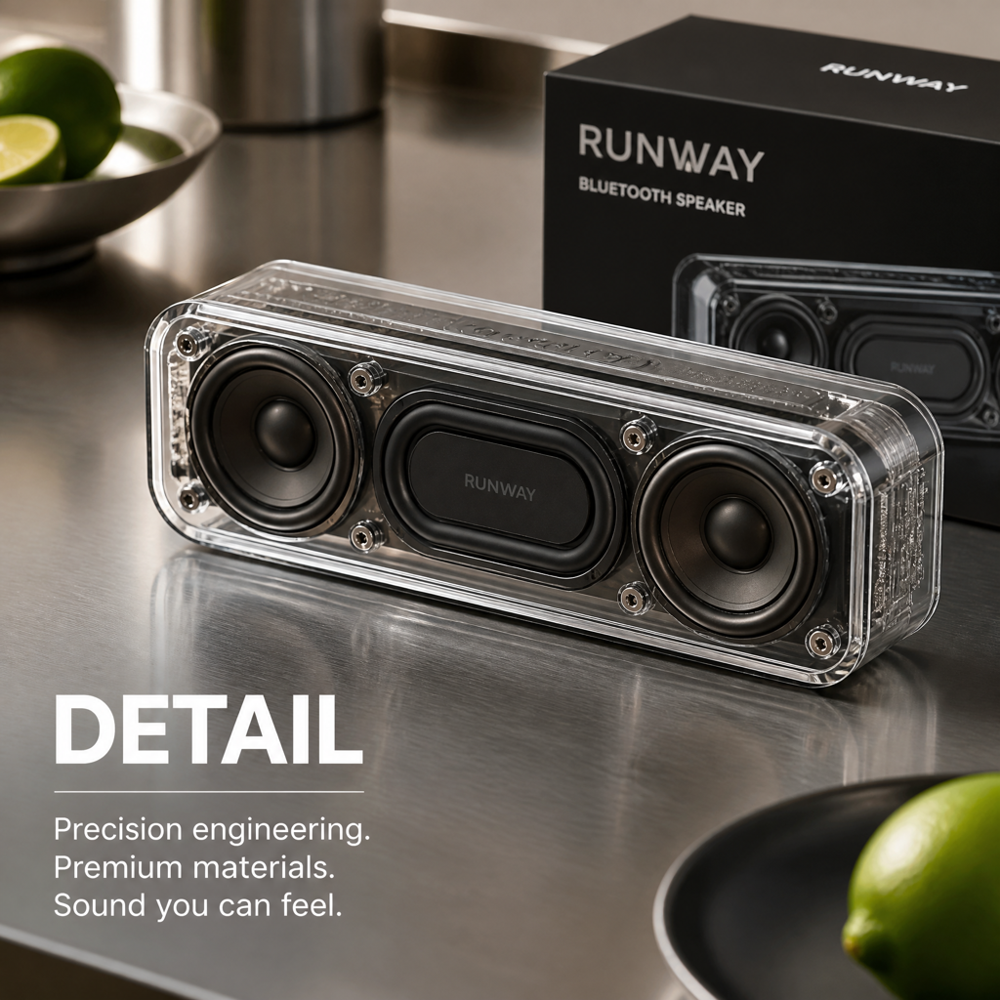
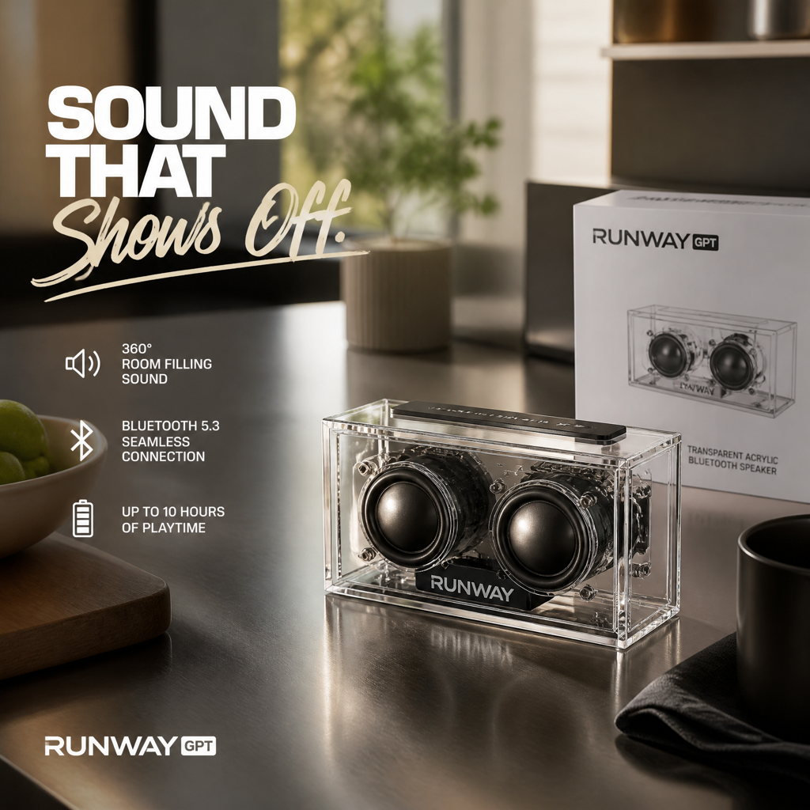

# `product-photoshoot` — one-line brief → multi-shot commercial recipe

> Showcases the **`runway product-photoshoot create`** recipe. Unlike a single `runway image` call, the recipe plans a coordinated set of shots (modes include `product_shot`, `lifestyle_scene`, `social_carousel`, `hero_banner`, `ad_creative_pack`, etc.) and renders them in a single command — ready-to-use commercial asset bundle from a one-line brief.

## 1. The prompt

What we hand to Claude — verbatim, the way a user would type it ([`prompt.md`](./prompt.md)):

> Use the runway `product-photoshoot create` recipe to plan and render a small product photoshoot from a one-line brief: a transparent acrylic Bluetooth speaker on a brushed steel kitchen counter, premium lifestyle aesthetic. Pick a sensible `--mode` (e.g. social_carousel or product_shot) that produces multiple visually distinct shots in one run. Save every generated image and the recipe plan, then emit a single result.json describing the brief, the chosen mode, the model, and the file paths.

## 2. Inputs

- `RUNWAY_API_KEY` (loaded from `.env`)
- The [`runway-cli`](https://github.com/tryAGI/Runway#use-as-an-agent-skill) skill installed at `.claude/skills/runway-cli/`
- **No pre-existing assets.**

## 3. What Claude did

Guided only by the skill, Claude:

1. **Picked a `--mode`** appropriate for the brief from the documented mode list.
2. **Ran `runway product-photoshoot create`** with the brief and the chosen mode.
3. **Captured every rendered shot** plus the recipe plan written by the CLI.
4. **Wrote `result.json`** tying it all together.

One CLI call (`product-photoshoot create`) that fans out into multiple `runway image` generations under the recipe's prompt-engineering layer.

## 4. Output

### The shots — `social_carousel` recipe, 4 frames

|  Hook                                                           |  Benefit                                                            |
|-----------------------------------------------------------------|---------------------------------------------------------------------|
|                      |                    |
|  Detail                                                         |  Lifestyle                                                          |
|                  |                |

Each shot follows a different social-carousel role (hook / benefit / detail / lifestyle), composed and captioned by the recipe's bundled prompt-engineering layer. Publication-ready commercial assets from a single one-line brief.

See [`sample-output/recipe-plan.json`](./sample-output/recipe-plan.json) for the executed plan.

### The `result.json` Claude wrote

See [`sample-output/result.json`](./sample-output/result.json).

## 5. Run it

```bash
./examples/product-photoshoot/run.sh
```

## 6. Cost & runtime

| Metric           | Value (observed)                                                       |
|------------------|------------------------------------------------------------------------|
| Wall time        | **~3 min** (4 × `gpt_image_2` shots at low quality)                    |
| Claude cost      | **$0.19** (Sonnet 4.6)                                                 |
| Runway credits   | **4** (1 credit per shot at `gpt_image_2` low-quality tier)            |
| Runway calls     | 1 × `product-photoshoot create --mode social_carousel` (fans out into 4 image gens) |
| Budget ceiling   | `CLAUDE_MAX_BUDGET_USD=4`                                              |

Because the recipe picked `gpt_image_2` at low quality, this is the **cheapest visual example in the repo by credit count** — even cheaper than a single `runway image` call (which costs ≈7 credits with `gemini-2.5-flash`). Higher quality tiers and different modes cost more.
