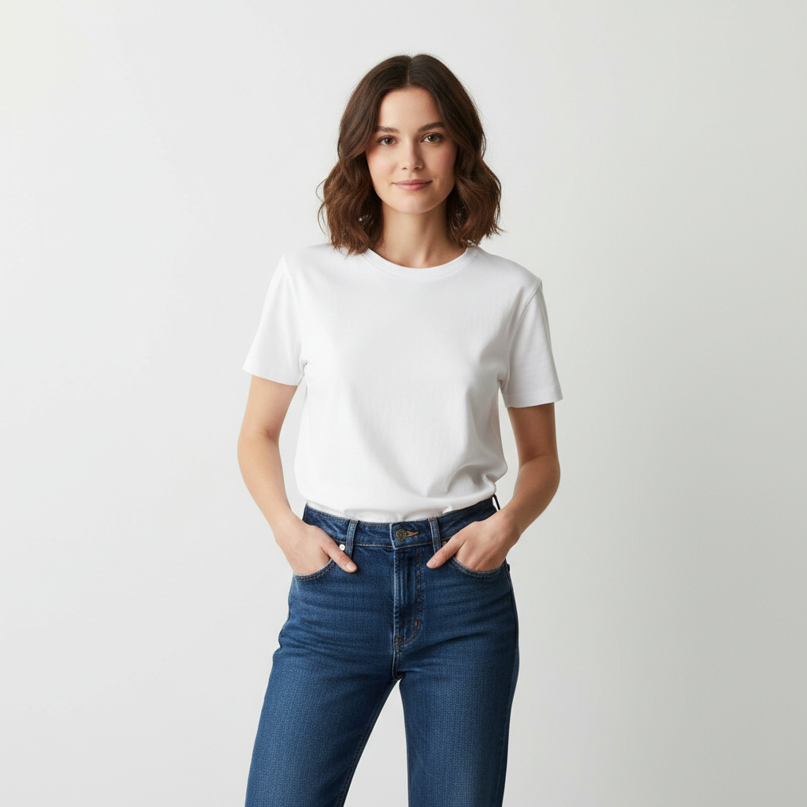
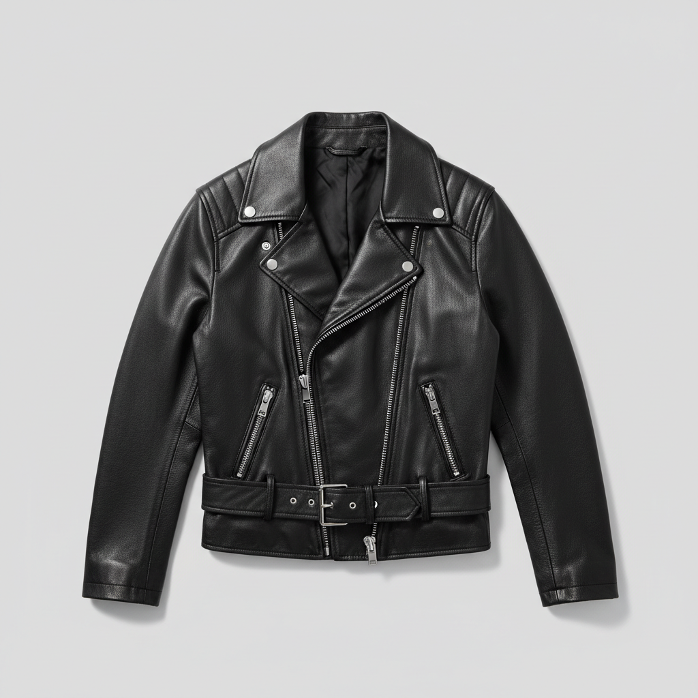

# `virtual-try-on` — put a generated garment on a generated person

> Showcases the **`virtual-try-on`** workflow: take two source images (person + garment) and produce a new image of the person wearing the garment in a chosen scene. Run from zero — both source images are generated on the fly.

## 1. The prompt

What we hand to Claude — verbatim, the way a user would type it ([`prompt.md`](./prompt.md)):

> Show off the `virtual-try-on` workflow from zero: first generate a portrait of a person in plain clothing, then generate a standalone product shot of a stylish leather jacket on a neutral background, then use the runway `virtual-try-on` workflow to put the jacket on the person against a foggy harbor at dawn. Save the original person, the garment, and the try-on result, then emit a single result.json describing each image path, the prompts, the scene, and the workflow used.

## 2. Inputs

- `RUNWAY_API_KEY` (loaded from `.env`)
- The [`runway-cli`](https://github.com/tryAGI/Runway#use-as-an-agent-skill) skill installed at `.claude/skills/runway-cli/` (done by `./scripts/setup.sh`)
- **No pre-existing assets** — Claude generates the person and the garment first.

## 3. What Claude did

Guided only by the skill, Claude:

1. **Generated a person portrait** via `runway image` (text-to-image) — a person in plain clothing on a neutral background.
2. **Generated a garment product shot** via `runway image` — a standalone leather jacket on a neutral background.
3. **Ran the `virtual-try-on` workflow** passing `--person <portrait>`, `--garment <jacket>`, `--scene "foggy harbor at dawn"`.
4. **Wrote `result.json`** tying the inputs to the output(s).

Three Runway calls total: two `runway image` + one `virtual-try-on` workflow.

## 4. Output

### Inputs and result

|  Person                                         |  Garment                                          |  Try-on — var 1                                    |  Try-on — var 2                                    |
|-------------------------------------------------|---------------------------------------------------|----------------------------------------------------|----------------------------------------------------|
|  |  |  |  |

The workflow returned **4 variations** (`03-tryon-1.png` → `06-tryon-4.png`); two are shown above.

### The `result.json` Claude wrote

See [`sample-output/result.json`](./sample-output/result.json) for the full file.

## 5. Run it

```bash
./examples/virtual-try-on/run.sh
```

Per-run output lands under `output/virtual-try-on/<ISO-timestamp>/` (same shape as the other examples).

## 6. Cost & runtime

| Metric           | Value (observed)                                  |
|------------------|---------------------------------------------------|
| Wall time        | **~3 min** (two images + workflow)                |
| Claude cost      | **~$0.55**                                        |
| Runway credits   | _measured on next runner-assisted run_            |
| Runway calls     | 2 × `runway image` + 1 × `virtual-try-on`         |
| Budget ceiling   | `CLAUDE_MAX_BUDGET_USD=3`                         |
