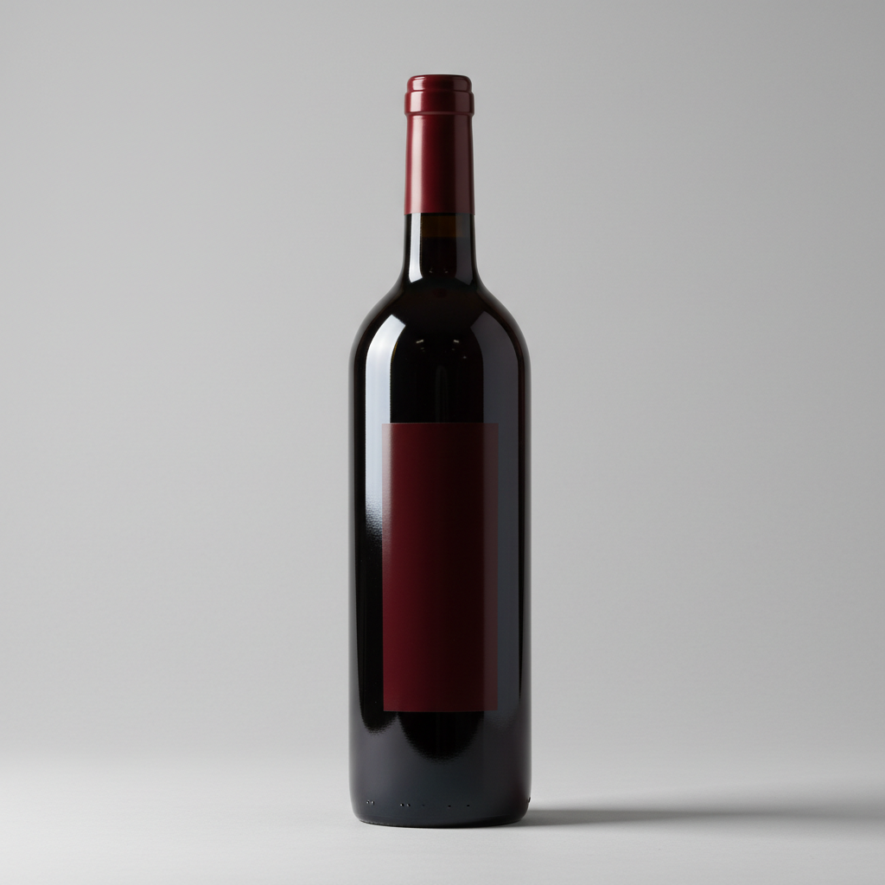
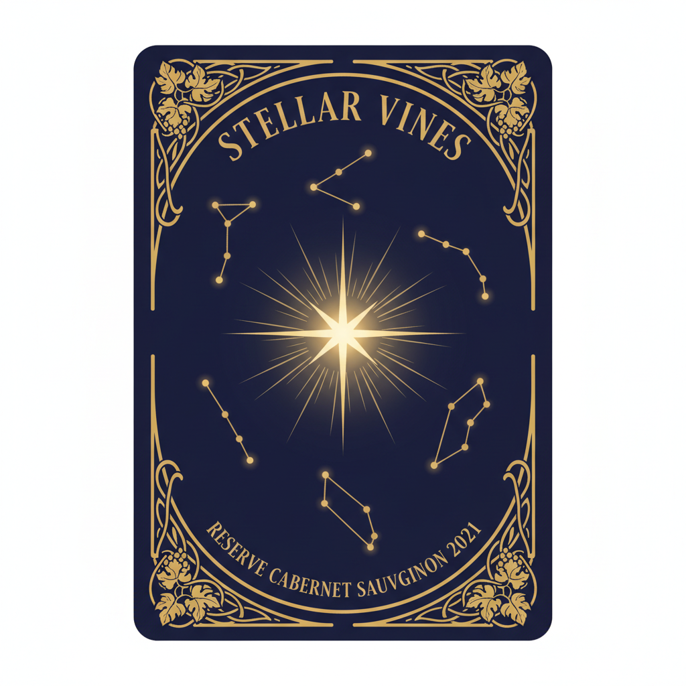
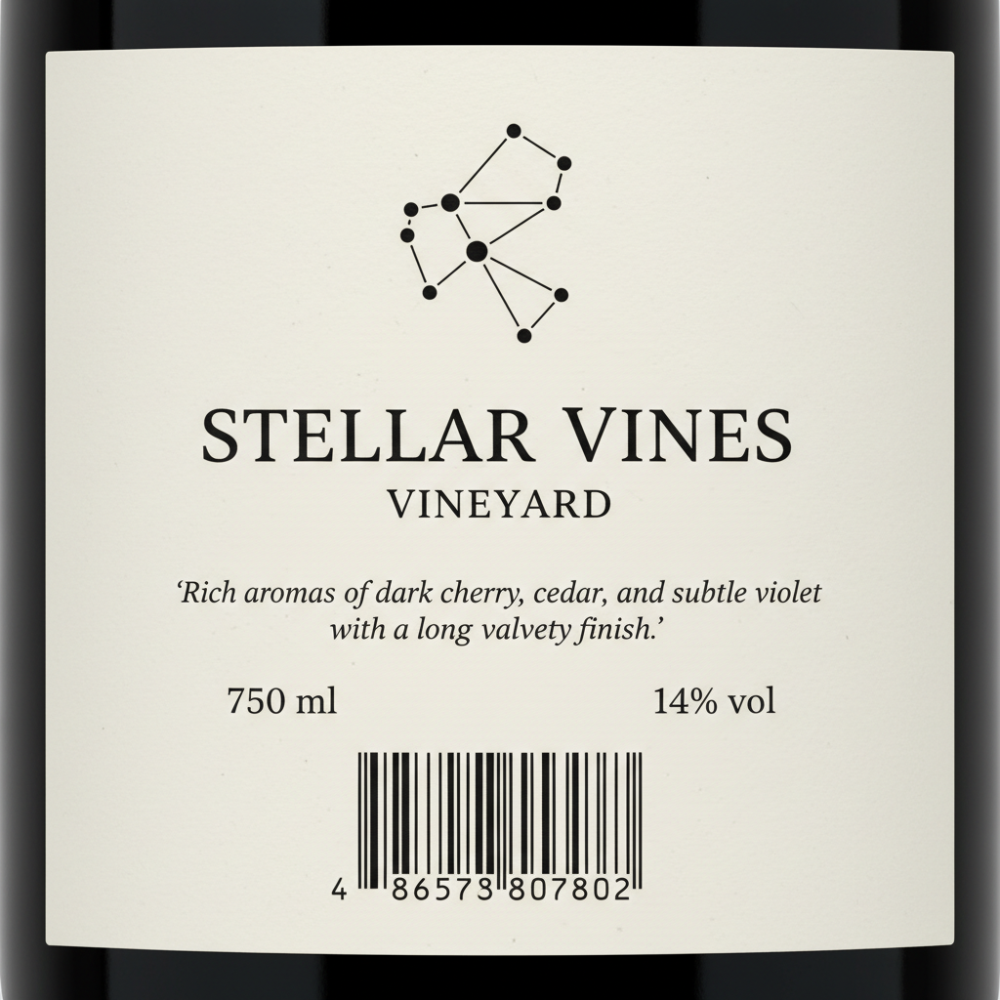
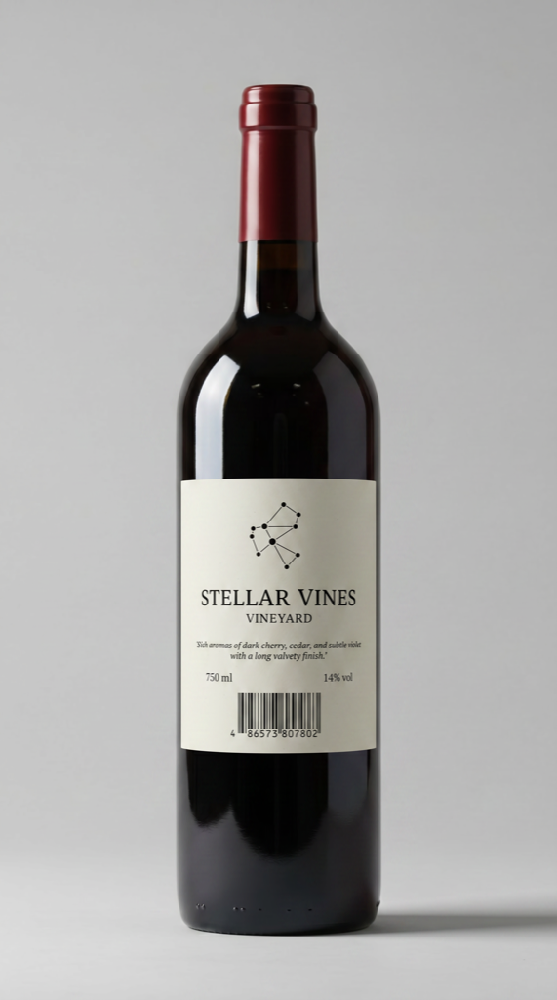
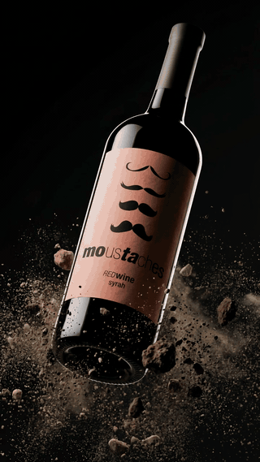

# `wine-label` — bottle + label artworks → cinematic hero MP4

> Showcases the **`wine-label-generator`** workflow — the only built-in named workflow that goes straight from still images to a final hero MP4. Run from zero: three source images (bottle + front label + back label) are generated, then composited and animated by the workflow.

## 1. The prompt

What we hand to Claude — verbatim, the way a user would type it ([`prompt.md`](./prompt.md)):

> Showcase the `wine-label-generator` workflow from zero: first generate three reference images — a tall dark glass wine bottle on a neutral background, a front label artwork for a fictional vineyard called "Stellar Vines" with celestial constellations, and a matching back label with elegant typography. Then run the runway `wine-label-generator` workflow with those three images and a cinematic `--video-prompt` like "shattered bottle suspended in mid-air, slow rotation, dramatic lighting" to produce a final hero MP4. Save each source image and the output MP4, and emit a single result.json describing the bottle, labels, prompts, video prompt, and workflow used.

## 2. Inputs

- `RUNWAY_API_KEY` (loaded from `.env`)
- The [`runway-cli`](https://github.com/tryAGI/Runway#use-as-an-agent-skill) skill installed at `.claude/skills/runway-cli/` (done by `./scripts/setup.sh`)
- **No pre-existing assets** — Claude generates the bottle and both labels first.

> **If you already have a bottle reference and two label artworks**, the prompt collapses to a single line. With `./bottle.jpg`, `./label-front.png`, `./label-back.png` on disk a real user would just type:
>
> > Use `wine-label-generator` with `./bottle.jpg`, `./label-front.png`, `./label-back.png` and a "shattered bottle suspended in mid-air, slow rotation" video prompt.
>
> The prompt this example commits is longer only because it has to generate the bottle and both labels from scratch.

## 3. What Claude did

Guided only by the skill, Claude:

1. **Generated a bottle reference** via `runway image` — tall dark glass on neutral background.
2. **Generated a front label** via `runway image` — celestial Stellar Vines artwork.
3. **Generated a back label** via `runway image` — matching elegant typography.
4. **Ran the `wine-label-generator` workflow** passing `--bottle`, `--label-1`, `--label-2`, `--video-prompt "shattered bottle suspended in mid-air ..."`.
5. **Wrote `result.json`** tying every input image and the output MP4 together.

Four Runway calls total: three `runway image` + one `wine-label-generator` workflow.

## 4. Output

### Source images

|  Bottle (`runway image`)                                          |  Front label (`runway image`)                                       |  Back label (`runway image`)                                       |
|-------------------------------------------------------------------|---------------------------------------------------------------------|--------------------------------------------------------------------|
|                    |            |             |

### Workflow output — composited bottle preview

The `wine-label-generator` workflow composites the labels onto the bottle and renders a final hero MP4. One frame of the composited bottle (downsampled from the workflow's intermediate output for repo size):



### Final hero MP4



Full-quality MP4 (720×1280 portrait, 8 s):
[`sample-output/assets/05-hero.mp4`](./sample-output/assets/05-hero.mp4). The workflow actually returned three MP4 variations (portrait 720p, landscape 1080p, portrait 1080p); the smallest is checked in to keep the repo size manageable.

### The `result.json` Claude wrote

See [`sample-output/result.json`](./sample-output/result.json) for the full file.

## 5. Run it

```bash
./examples/wine-label/run.sh
```

Per-run output lands under `output/wine-label/<ISO-timestamp>/` (same shape as the other examples).

## 6. Cost & runtime

| Metric           | Value (observed)                                                 |
|------------------|------------------------------------------------------------------|
| Wall time        | **~7 min** (3 image gens + 8 s video render)                     |
| Claude cost      | **$0.65** (Sonnet 4.6)                                           |
| Runway credits   | **1241** (≈21 for the three image gens + ≈1220 for the video workflow returning 3 variations + intermediates) |
| Runway calls     | 3 × `runway image` + 1 × `wine-label-generator` (video)          |
| Budget ceiling   | `CLAUDE_MAX_BUDGET_USD=4`                                        |
